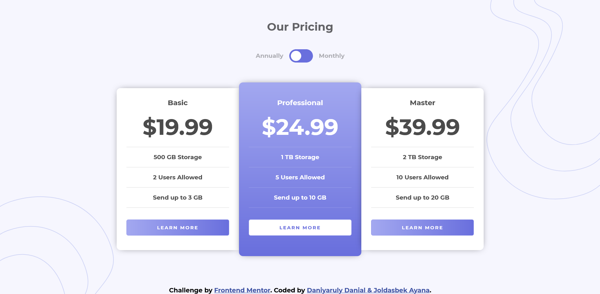

# Frontend Mentor - Pricing component with toggle solution

This is a solution to the [Pricing component with toggle challenge on Frontend Mentor](https://www.frontendmentor.io/challenges/pricing-component-with-toggle-8vPwRMIC). Frontend Mentor challenges help you improve your coding skills by building realistic projects. 

## Table of contents

- [Overview](#overview)
  - [The challenge](#the-challenge)
  - [Screenshot](#screenshot)
  - [Links](#links)
- [Process](#process)
  - [Built with](#built-with)
  - [What we learned](#what-we-learned)
  - [Useful resources](#useful-resources)
- [Authors](#authors)


## Overview

### The challenge

Users should be able to:

- View the optimal layout for the component depending on their device's screen size
- Control the toggle with both their mouse/trackpad and their keyboard
- **Bonus**: Complete the challenge with just HTML and CSS

### Screenshot




### Links

- Solution URL: [Add solution URL here](https://your-solution-url.com)
- Live Site URL: [Add live site URL here](https://your-live-site-url.com)

## Process

### Built with

- Semantic HTML5 markup
- CSS custom properties
- Flexbox
- CSS Position and Transitions
- Simple JS


### What we learned

```html
<label class="toggle">
  <input id="checkbox" type="checkbox" name="toggle" onchange="newPrice()">
  <span class="slider"></span> 
</label>
```
```css
.card {
  width: 25%;
  display: inline-block;
  background-color: #fff;
  padding: 25px;
  box-shadow: 0px 0px 19px -8px rgba(0, 0, 0, 0.75);
  box-sizing: border-box;
}
```
```js
function newPrice() {
    var basic = document.getElementById('basic-price');

    if (document.getElementById('checkbox').checked) {
      basic.innerHTML = '&dollar;199.99';
    }
    else {
      basic.innerHTML = '&dollar;19.99';
    }
  }
```


### Useful resources

(https://www.w3schools.com/howto/howto_css_switch.asp) - This site helped us create a Toggle Switch.


## Authors

- Website - [Add your name here](https://www.your-site.com)
- Frontend Mentor - [@ZZZAyana](https://www.frontendmentor.io/profile/ZZZAyana)
- Frontend Mentor - [@TurboDanik](https://www.frontendmentor.io/profile/TurboDanik)